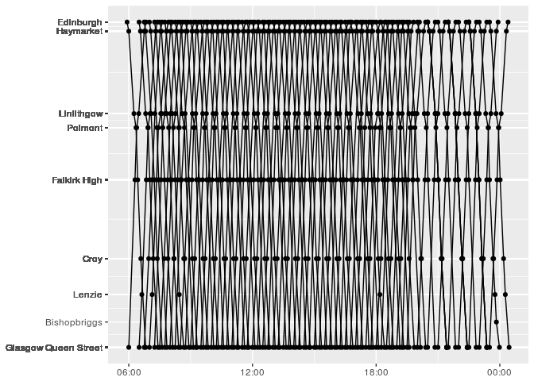

<!-- README.md is generated from README.Rmd. Please edit that file -->
stringliner
===========

Use stringliner to plot a recreation of E.J. Marey's graphical train schedule (aka a stringline chart). See a D3 version [here](https://bl.ocks.org/mbostock/5544008).

Example
-------

Currently this function only plots data saved in the extdata directory. Plot the Monday to Friday route between Edinburgh and Glasgow like this (correct until 9th December 2017):

``` r
library(tidyverse)
library(lubridate)
library(stringliner)

string_line()
```



Installation
------------

Install stringliner from GitHub like this:

``` r
# install.packages("devtools")
devtools::install_github("jsphdms/stringliner")
```
