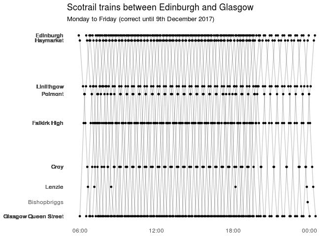

<!-- README.md is generated from README.Rmd. Please edit that file -->
stringliner
===========

Use stringliner to plot a recreation of E.J. Marey's graphical train schedule (aka a stringline chart)

Example
-------

Currently this function only plots data saved in the extdata directory. Plot the Monday to Friday route between Edinburgh and Glasgow like this:

``` r
library(tidyverse)
#> Loading tidyverse: ggplot2
#> Loading tidyverse: tibble
#> Loading tidyverse: tidyr
#> Loading tidyverse: readr
#> Loading tidyverse: purrr
#> Loading tidyverse: dplyr
#> Conflicts with tidy packages ----------------------------------------------
#> filter(): dplyr, stats
#> lag():    dplyr, stats
library(lubridate)
#> 
#> Attaching package: 'lubridate'
#> The following object is masked from 'package:base':
#> 
#>     date
library(stringliner)
string_line()
#> Warning: attributes are not identical across measure variables;
#> they will be dropped
#> Joining, by = "station"
#> Warning: Column `station` joining character vector and factor, coercing
#> into character vector
```


